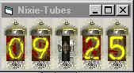



## nixie\_tube

### Description

Hey old timers, remember the good old days when all we had for digital numbers were the vacuum tubes called "nixie" displays? Well, here they are in .gif form. Use these anyway you like. In this example, a clock. Or, use them on a webpage using Java ... Enjoy and Savor the Memories!
 
### More Info
 

             |
---                |---
**Submitted On**   |2002-02-15 09:26:46
**By**             |[Max Seim](https://github.com/Planet-Source-Code/PSCIndex/blob/master/ByAuthor/max-seim.md)
**Level**          |Beginner
**User Rating**    |4.9 (34 globes from 7 users)
**Compatibility**  |VB 5\.0, VB 6\.0
**Category**       |[Complete Applications](https://github.com/Planet-Source-Code/PSCIndex/blob/master/ByCategory/complete-applications__1-27.md)
**World**          |[Visual Basic](https://github.com/Planet-Source-Code/PSCIndex/blob/master/ByWorld/visual-basic.md)
**Archive File**   |[nixie\_tube554202152002\.zip](https://github.com/Planet-Source-Code/max-seim-nixie-tube__1-31830/archive/master.zip)

